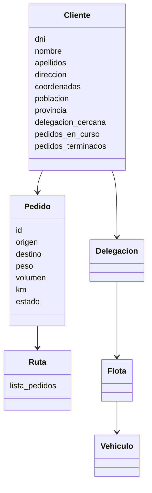
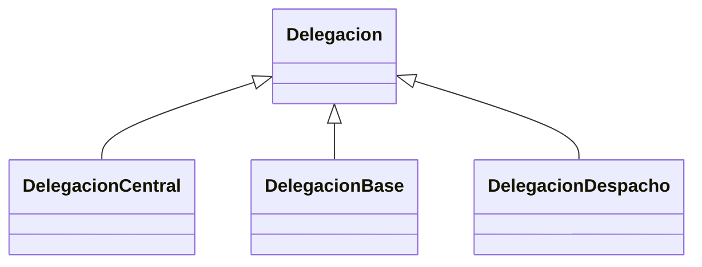
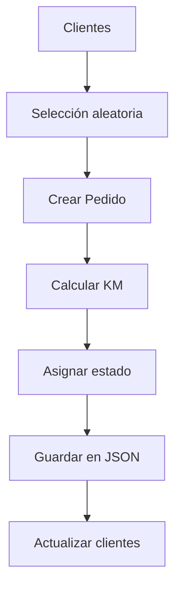

# 🚚 Sistema de Gestión Logística en Python


---

## 📌 Descripción

Sistema completo de gestión logística desarrollado en Python que permite:

- Gestión de clientes
- Gestión de pedidos
- Gestión de rutas
- Gestión de delegaciones y flotas
- Geolocalización de direcciones reales
- Visualización en mapas interactivos

El proyecto está diseñado siguiendo principios de **Programación Orientada a Objetos (POO)**, con persistencia en JSON y arquitectura modular desacoplada.

---

# 🧠 Arquitectura del sistema

El sistema se organiza en capas independientes:

### 🔹 Dominio (`clases/`)
Contiene la lógica del negocio:
- Cliente
- Pedido
- Ruta
- Delegación
- Vehículo
- Flota

### 🔹 Persistencia (`persistencia/`)
- Lectura y escritura en JSON
- Normalización de datos
- Compatibilidad de formatos
- Cache de geocodificación

### 🔹 Utilidades (`utiles/`)
- Geolocalización (geopy)
- Cálculo de distancias
- Funciones auxiliares

### 🔹 Aplicación (`programas/`)
- mantenimiento_clientes
- mantenimiento_pedidos

### 🔹 Interfaz (`menu/`)
- Navegación por consola

### 🔹 Tests (`tests/`)
- Generación de datos
- Pruebas funcionales

---

## 🧩 Flujo de ejecución

```
main.py
   ↓
menu/
   ↓
programas/
   ↓
clases/
   ↓
persistencia/
   ↓
datos/
```

---

# 🧱 Estructura del proyecto

```
logistica/
│
├── clases/
│   ├── cliente.py
│   ├── pedido.py
│   ├── ruta.py
│   ├── delegacion.py
│   ├── vehiculo.py
│   └── flota.py
│
├── persistencia/
│   ├── persistencia_clientes.py
│   ├── persistencia_pedidos.py
│   ├── persistencia_delegaciones.py
│   └── geocoding_cache.py
│
├── utiles/
│   ├── utils.py
│   └── geolocalizacion.py
│
├── datos/
│   ├── clientes.json
│   ├── pedidos.json
│   ├── delegaciones.json
│   ├── mapa_clientes.html
│   ├── mapa_delegaciones.html
│   └── mapa_pedidos.html
│
├── programas/
│   ├── mantenimiento_clientes.py
│   └── mantenimiento_pedidos.py
│
├── menu/
│   └── menu_principal.py
│
├── tests/
│   ├── test_10_generar_clientes.py
│   ├── test_15_prueba_delegaciones.py
│   └── test_16_generar_pedidos.py
│
└── main.py
```

---

# 📊 Diagramas UML

## 🔹 Modelo de clases



---

## 🔹 Herencia de delegaciones



---

## 🔹 Flujo de pedidos



---

# ⚙️ Tecnologías

- Python 3.9+
- folium (mapas)
- geopy (geolocalización)
- JSON (persistencia)
- Programación Orientada a Objetos (POO)

---

# 🚀 Instalación

```bash
git clone <repo>
cd logistica
python -m venv .venv
source .venv/bin/activate
pip install folium geopy
```

---

# ▶️ Ejecución

```bash
python main.py
```

---

# 🔄 Persistencia

Archivos utilizados:

- datos/clientes.json  
- datos/pedidos.json  
- datos/delegaciones.json  

✔ Compatible  
✔ Normalización automática  
✔ Uso de cache  

---

# ⚠️ Consideraciones

- Las APIs de geolocalización tienen límites de uso  
- Algunas direcciones pueden no resolverse  
- Se recomienda usar cache  

---

# 📈 Mejoras futuras

- Optimización de rutas (2-opt / TSP)  
- Interfaz gráfica  
- API REST  
- Base de datos real  
- Dashboard  

---

# 👨‍💻 Autores

- Manuel Quiles Gómez  
- Anton Koniaev  

---

# 📄 Licencia

Uso educativo / académico